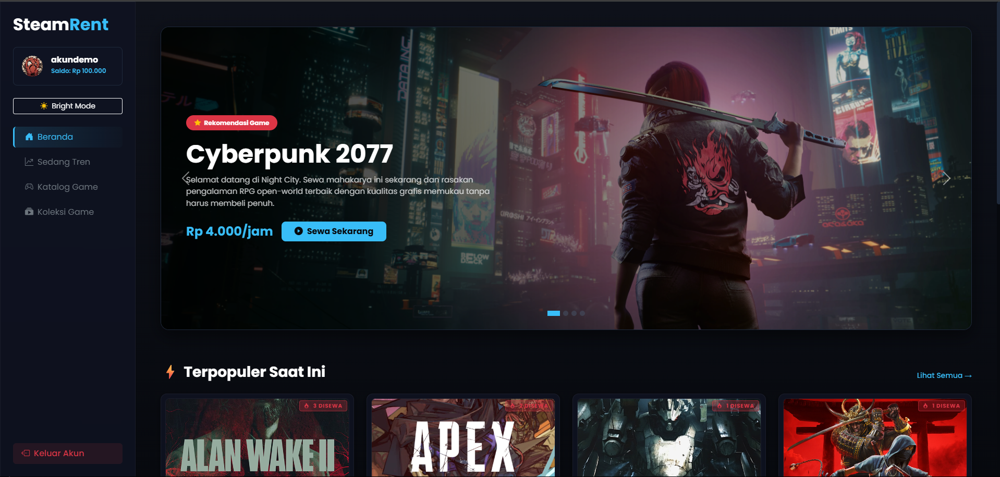
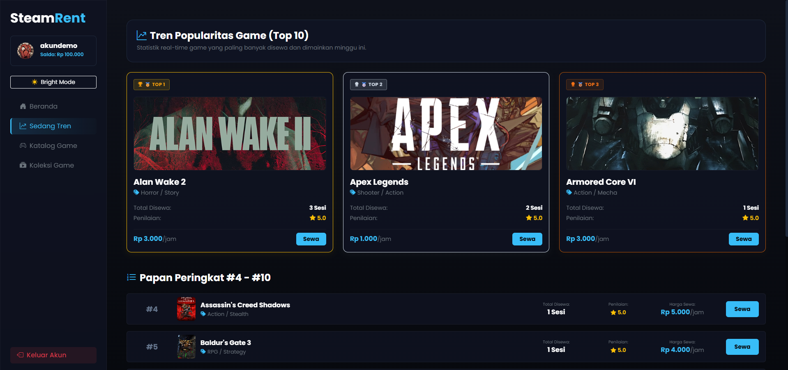
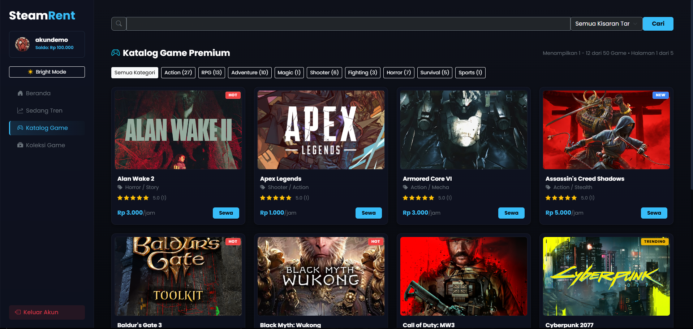
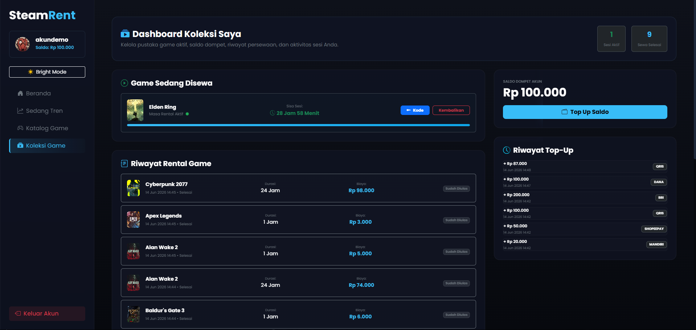
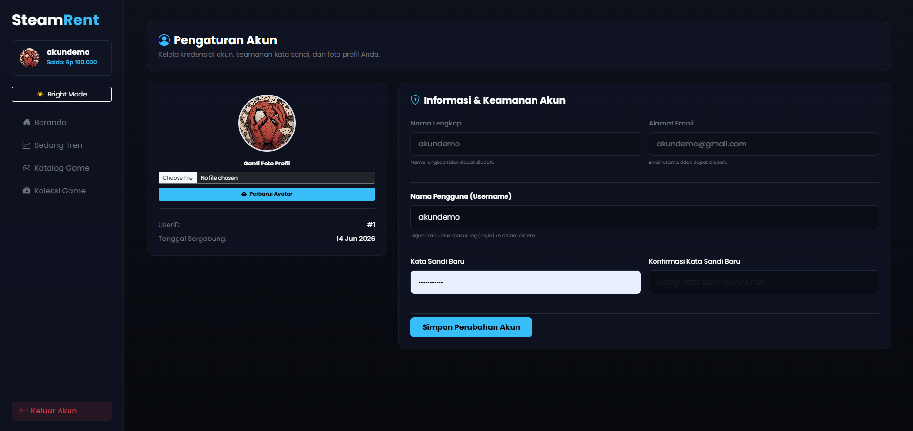
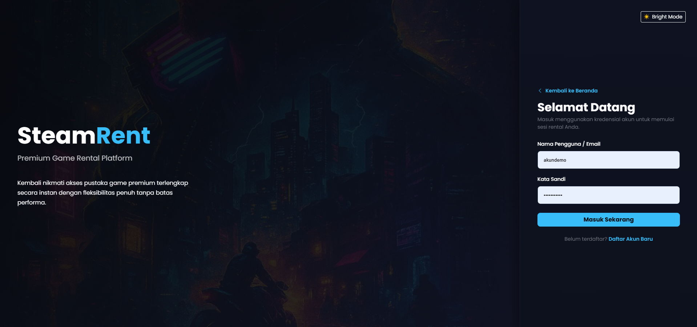

# SteamRent

> A web-based game rental platform built with PHP and MySQL.

**Current Version:** v1.0.0 Stable

SteamRent is a web-based game rental platform developed using PHP and MySQL. The application enables users to browse game catalogs, rent games, manage collections, submit reviews, and perform balance top-ups through a responsive and user-friendly interface.

Originally developed as a university project, SteamRent was later refined as a personal portfolio project to showcase web application development, database design, and user experience implementation.

---

## About

SteamRent simulates a modern digital game rental service where users can discover games, rent titles using account balance, manage personal collections, and interact with the platform through reviews and rankings.

The project focuses on practical implementation of:

* User Authentication
* Database Management
* CRUD Operations
* Session Handling
* File Upload Management
* Responsive User Interface Design
* PHP & MySQL Integration

---

## Release Information

**Version:** v1.0.0

**Status:** Stable Release

### Release Highlights

* Complete Authentication System
* Game Catalog & Search Functionality
* Trending Games Ranking
* Rental Management System
* User Collection Dashboard
* Wallet & Top-Up Features
* Review & Rating System
* Responsive Layout
* Dark / Light Mode Support

---

## Repository Information

**Repository Type:** Public

This repository is maintained as a portfolio and educational project demonstrating the development of a full-stack web application using PHP Native and MySQL.

---

## Key Features

### User Features

* User Registration & Login
* Profile Management
* Avatar Upload
* Dark / Light Mode

### Game Features

* Game Catalog
* Search & Filter
* Trending Games Ranking
* Hero Carousel Banner

### Rental Features

* Game Rental System
* Rental History
* Active Rental Tracking

### Wallet Features

* Balance Management
* Top Up System
* Transaction History

### Community Features

* Reviews & Ratings

---

## Technology Stack

### Frontend

* HTML5
* CSS3
* JavaScript

### Backend

* PHP Native

### Database

* MySQL

### Development Environment

* XAMPP

---

## Screenshots

### Home Page



The landing page of SteamRent featuring a hero banner, featured games, navigation menu, and quick access to the platform's main services.

---

### Trending Games



Displays the most popular games based on rental activity, allowing users to discover currently trending titles within the platform.

---

### Game Catalog



A searchable and filterable catalog containing available games, complete with cover images, rental prices, and game information.

---

### Collection Dashboard



Allows users to view and manage their rented games, track rental status, and access their personal game collection.

---

### Profile Page



Provides account management features including profile information, avatar customization, account settings, and balance information.

---

### Login Page



Secure authentication page that enables users to access their accounts and platform features.

---

## Responsive Design

SteamRent is designed to provide a consistent experience across multiple screen sizes and devices:

* Mobile
* Tablet
* Laptop
* Desktop

---

## Installation

### 1. Clone the Repository

```bash
git clone https://github.com/istmaa/steamrent-game-rental.git
```

### 2. Move the Project

Place the project folder inside:

```text
xampp/htdocs/
```

### 3. Start XAMPP Services

Start the following services:

* Apache
* MySQL

### 4. Configure the Database

Create a MySQL database and import the provided SQL file.

### 5. Configure Database Credentials

Edit the database configuration file:

```text
includes/config.php
```

### 6. Run the Application

Open your browser and visit:

```text
http://localhost/steamrent
```

---

## Project Structure

```text
steamrent/
├── assets/
│   ├── css/
│   ├── js/
│   └── images/
├── includes/
├── pages/
├── uploads/
├── docs/
├── index.php
├── login.php
├── register.php
└── README.md
```

---

## Academic Background

This project was originally developed as part of a university web programming and database course project. The repository has since been refined and organized as a portfolio project to demonstrate practical implementation of:

* Web Application Development
* Database Design
* User Authentication
* CRUD Operations
* Responsive User Interface Design
* PHP & MySQL Integration

---

## License

This project is intended for educational and portfolio purposes.
